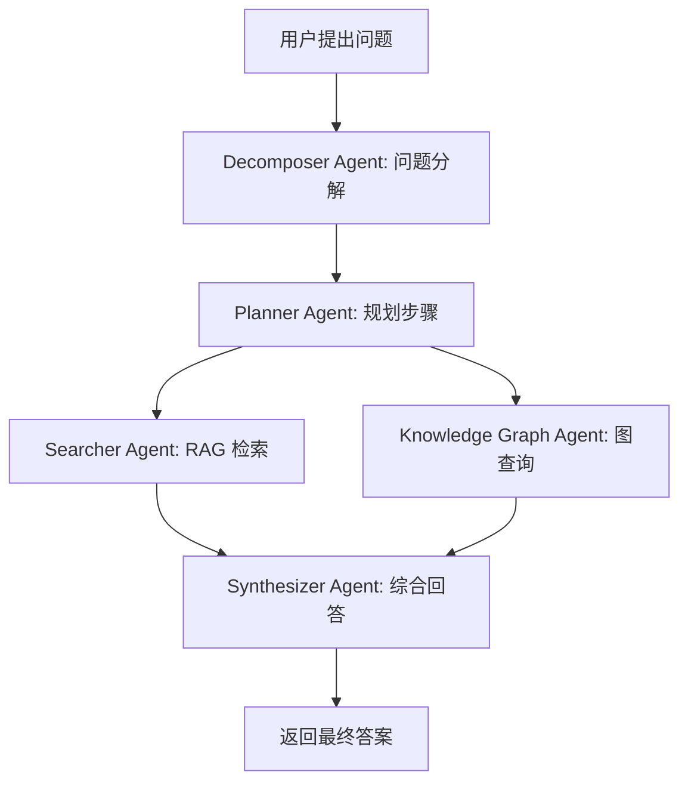

# 第一届AI全栈黑客松 — 完整技术开发方案 v1

> 项目名称：AI 教科书知识系统（AI-Powered Textbook Knowledge System）
> 技术栈：Python（FastAPI）+ Vue 3 + LLM API + RAG + Agent + 知识图谱

---

## 一、项目文件层级架构

```
textbook-knowledge-system/
├── .gitignore                     # Git 忽略规则（含 *.pdf）
├── .env.example                   # 环境变量模板
├── README.md                      # 项目说明 & 快速开始
├── requirements.txt               # Python 依赖
├── package.json                   # 前端依赖（Vue 3）
├── docker-compose.yml             # Docker 编排
├── Dockerfile                     # 后端容器化
│
├── data/                          # 数据目录
│   ├── textbooks/                 # 原始 PDF/文档（gitignored）
│   ├── parsed/                    # 解析后的 JSON
│   │   └── book_01.json
│   ├── chunks/                    # Chunk 向量库索引
│   │   └── faiss_index.bin
│   ├── knowledge_graph/           # 知识图谱数据
│   │   ├── nodes.json
│   │   └── edges.json
│   └── rag_benchmark/             # RAG Benchmark 数据
│       └── ground_truth.json
│
├── src/                           # 后端源代码
│   ├── __init__.py
│   ├── main.py                    # FastAPI 入口
│   ├── config.py                  # 全局配置
│   │
│   ├── ingestion/                 # P0-1: 数据解析
│   │   ├── __init__.py
│   │   ├── parser_factory.py      # 解析器工厂模式
│   │   ├── pdf_parser.py          # PDF 解析（PyMuPDF）
│   │   ├── md_parser.py           # Markdown 解析
│   │   ├── txt_parser.py          # TXT 解析
│   │   ├── docx_parser.py         # Word 解析（python-docx）
│   │   ├── excel_parser.py        # Excel 解析（pandas/openpyxl）
│   │   └── models.py             # 数据结构: TextbookSchema, ChapterSchema
│   │
│   ├── knowledge_graph/           # P0-2,3,4: 知识图谱
│   │   ├── __init__.py
│   │   ├── builder.py             # LLM 驱动的图谱构建
│   │   ├── relation_extractor.py  # 关系抽取（prerequisite/parallel/contains/applies_to）
│   │   ├── graph_store.py         # 图谱存储（NetworkX + JSON）
│   │   ├── merger.py              # 跨书知识合并（merge/keep/remove）
│   │   └── query_engine.py        # 知识图谱问答引擎（P0-7）
│   │
│   ├── rag/                       # P0-5: RAG Pipeline
│   │   ├── __init__.py
│   │   ├── chunker.py             # Chunk 策略（500-800 chars + 50-100 sliding window）
│   │   ├── embedder.py            # Embedding（sentence-transformers / API）
│   │   ├── vector_store.py        # 向量存储（FAISS + BM25 混合检索）
│   │   ├── retriever.py           # 检索器（top-5 + hybrid + rerank）
│   │   ├── generator.py           # LLM 生成（含 citations 引用）
│   │   └── benchmark.py           # RAG Benchmark 评测
│   │
│   ├── agent/                     # P0-6: Agent 系统
│   │   ├── __init__.py
│   │   ├── orchestrator.py        # Agent 编排（主控制器）
│   │   ├── agent_decomposer.py    # Agent: 问题分解
│   │   ├── agent_planner.py       # Agent: 规划步骤
│   │   ├── agent_retriever.py     # Agent: RAG 检索
│   │   ├── agent_synthesizer.py   # Agent: 综合回答
│   │   └── agent_workflow.py      # Agent 工作流定义（Mermaid）
│   │
│   ├── api/                       # API 路由
│   │   ├── __init__.py
│   │   ├── ingestion_routes.py    # POST /api/ingestion/upload
│   │   ├── graph_routes.py        # GET/POST /api/graph/*
│   │   ├── rag_routes.py          # POST /api/rag/index, /api/rag/query
│   │   ├── agent_routes.py        # POST /api/agent/query
│   │   └── report_routes.py       # GET /api/report/generate
│   │
│   └── report/                    # P0-9: 报告生成
│       ├── __init__.py
│       └── generator.py           # Markdown 报告生成器
│
├── frontend/                      # Vue 3 前端
│   ├── index.html
│   ├── vite.config.js
│   ├── package.json
│   ├── src/
│   │   ├── App.vue                # 根组件（Tab 布局）
│   │   ├── main.js
│   │   ├── api/                   # API 客户端
│   │   │   └── client.js
│   │   ├── router/
│   │   │   └── index.js           # Tab 路由
│   │   ├── views/                 # 页面视图
│   │   │   ├── KnowledgeGraphView.vue   # P0-3: 知识图谱可视化
│   │   │   ├── RAGQueryView.vue         # P0-5: RAG 问答
│   │   │   ├── KnowledgeMergeView.vue   # P0-4: 知识合并
│   │   │   ├── AgentView.vue            # P0-6: Agent 工作流
│   │   │   ├── SettingsView.vue         # 设置
│   │   │   └── ReportView.vue           # P0-9: 报告
│   │   ├── components/            # 通用组件
│   │   │   ├── GraphCanvas.vue          # 图谱画布(D3.js/Cytoscape)
│   │   │   ├── GraphFilter.vue          # 节点筛选/搜索
│   │   │   ├── ChatPanel.vue            # RAG/Agent 对话面板
│   │   │   ├── CitationCard.vue         # 引用卡片
│   │   │   └── UploadZone.vue           # 拖拽上传
│   │   └── styles/
│   │       └── main.css
│   └── public/
│       └── favicon.ico
│
├── docs/                          # P0-10: 文档
│   ├── api.md                     # API 文档
│   ├── design.md                  # 系统设计文档
│   ├── Agent.md                   # Agent 设计文档
│   └── report.md                  # 赛题报告（7 项评测）
│
└── report/                        # P0-9: 输出报告目录
    └── competition_report.md
```

---

## 二、各需求完整技术实现

---

### P0-1: 数据解析（Data Ingestion & Parsing）

#### 功能要求
- 支持 PDF / Markdown / TXT / Word(.docx) / Excel 格式解析
- 按章节结构提取：book_id, title, chapters, page, char_count
- 输出标准 JSON Schema

#### 技术方案

**解析策略 — 工厂模式**

每个解析器实现统一接口 `BaseParser`，通过 `ParserFactory` 根据文件扩展名分发：

```python
class BaseParser(ABC):
    @abstractmethod
    def parse(self, file_path: str) -> TextbookSchema: ...

class PDFParser(BaseParser):
    def parse(self, file_path: str) -> TextbookSchema:
        # 1. PyMuPDF (fitz) 打开文档
        # 2. 提取目录/大纲获取章节边界
        # 3. 逐页提取文本 + 页码
        # 4. 按章节聚合文本
        # 5. 计算 char_count
        # 6. 组装 TextbookSchema
```

| 格式 | 库 | 策略 |
|------|----|------|
| PDF | PyMuPDF (fitz) | 提取文本 + 目录解析，TOC 自动识别章节层级 |
| Markdown | 正则 + frontmatter | 按 `# / ## / ###` 分割章节 |
| TXT | 内置 open() | 按空行 / 自定义分隔符分割 |
| DOCX | python-docx | 遍历 paragraph + 识别 heading 样式 |
| Excel | pandas/openpyxl | 每 sheet 作为一章，行作为内容 |

**输出 JSON Schema（与赛题一致）：**
```json
{
  "textbook_id": "book_01",
  "filename": "example.pdf",
  "title": "教科书标题",
  "total_pages": 520,
  "total_chars": 385000,
  "chapters": [{
    "chapter_id": "ch_01",
    "title": "第一章标题",
    "page_start": 1,
    "page_end": 15,
    "content": "完整文本内容...",
    "char_count": 8500
  }]
}
```

#### API 接口
```
POST /api/ingestion/upload
  Body: multipart/form-data (file + textbook_id)
  Response: TextbookSchema JSON

GET /api/ingestion/list
  Response: 已解析教科书列表

DELETE /api/ingestion/{textbook_id}
  Response: 删除确认
```

---

### P0-2: 知识图谱构建（Knowledge Graph Construction）

#### 功能要求
- 调用 LLM 从教科书内容提取概念节点
- 抽取四种关系：prerequisite / parallel / contains / applies_to
- 支持 few-shot prompt + JSON 结构化输出

#### 技术方案

**节点抽取 Prompt 设计：**

```
你是一个教科书知识抽取助手。请从以下章节内容中提取核心概念术语。

【输出格式】
{
  "nodes": [
    {
      "id": "node_001",
      "name": "概念名称",
      "definition": "精确定义（15-30字）",
      "category": "所属分类",
      "chapter": "所属章节ID",
      "page": 35
    }
  ]
}

【few-shot 示例】
内容："炎症是机体对损伤因子的防御反应..."
→ {"id": "node_001", "name": "炎症", "definition": "机体对损伤因子的防御反应", "category": "病理学", "chapter": "ch_01", "page": 2}
```

**关系抽取 Prompt 设计：**

```
请判断以下两个概念之间的关系类型（prerequisite / parallel / contains / applies_to）：

A: {node_a_name} ({node_a_definition})
B: {node_b_name} ({node_b_definition})

关系定义：
- prerequisite: A 是 B 的前提/基础（B 依赖于 A）
- parallel: A 和 B 是同级并列关系
- contains: A 包含 B（B 是 A 的子集/组成部分）
- applies_to: A 适用于 B（A 对 B 生效）

【输出 JSON】
{
  "source": "node_001",
  "target": "node_002",
  "relation_type": "prerequisite",
  "description": "原因是..."
}
```

**执行流程：**
1. 对每章内容，分段调用 LLM 抽取节点
2. 对所有节点两两组合，调用 LLM 判断关系（或批量处理）
3. 存储至 `graph_store.py`

---

### P0-3: 知识图谱可视化（Knowledge Graph Visualization）

#### 功能要求
- 交互式图谱展示（节点+边）
- 节点筛选、搜索、定位
- 推荐使用 D3.js / ECharts / Cytoscape.js / AntV G6

#### 技术方案

选择 **Cytoscape.js**（专为图/网络可视化设计，性能好，交互丰富）：

```javascript
// Cytoscape 实例化
const cy = cytoscape({
  container: document.getElementById('graph'),
  elements: [
    { data: { id: 'node_001', name: '炎症', category: '病理学' } },
    { data: { id: 'edge_001', source: 'node_001', target: 'node_002', 
               label: 'prerequisite', relation_type: 'prerequisite' } }
  ],
  style: [
    { selector: 'node', style: {
      'background-color': '#6fb1fc',
      'label': 'data(name)',
      'width': 60, 'height': 60,
      'font-size': '12px'
    }},
    { selector: 'edge[relation_type = "prerequisite"]', style: {
      'line-color': '#ff6b6b', 'target-arrow-color': '#ff6b6b',
      'label': 'data(label)', 'curve-style': 'bezier'
    }},
    { selector: 'edge[relation_type = "parallel"]', style: {
      'line-color': '#51cf66', 'target-arrow-color': '#51cf66'
    }},
    { selector: 'edge[relation_type = "contains"]', style: {
      'line-color': '#ffd43b', 'target-arrow-color': '#ffd43b'
    }},
    { selector: 'edge[relation_type = "applies_to"]', style: {
      'line-color': '#cc5de8', 'target-arrow-color': '#cc5de8'
    }}
  ],
  layout: { name: 'cose', nodeRepulsion: 8000 }
});
```

**交互功能：**
- 缩放/拖拽/点击节点查看详情
- 搜索框实时筛选节点
- 按类别/category 着色
- 按关系类型筛选边
- 布局切换（力导向 / 层次 / 圆形）

**API 接口：**
```
GET /api/graph/nodes?textbook_id=book_01
GET /api/graph/edges?textbook_id=book_01
GET /api/graph/search?q=炎症
```

---

### P0-4: 知识合并（Knowledge Merging）

#### 功能要求
- 跨教科书合并相同/相似概念节点
- LLM 决策：merge / keep / remove
- 去重率目标 30%
- 置信度评分

#### 技术方案

```python
class KnowledgeMerger:
    def merge_cross_books(self, all_nodes: List[Node]) -> List[Node]:
        # 1. 基于名称/定义的语义相似度初筛（embedding cosine）
        # 2. 候选组送入 LLM 做合并决策
        # 3. 执行合并操作，更新知识图谱
        
    def llm_merge_decision(self, candidate_group: List[Node]) -> MergeDecision:
        """
        Prompt:
        以下为来自不同教科书的若干概念节点，请判断它们是否指向同一概念：
        [{node_1}, {node_2}, ...]
        决策: merge(合并) / keep(保留) / remove(删除)
        """
```

**去重策略：**
1. Embedding 计算所有节点向量
2. 余弦相似度 > 0.85 的节点进入候选池
3. 候选池每组送 LLM 裁决
4. 裁决为 merge 的合并属性和引用

---

### P0-5: RAG Pipeline（Retrieval-Augmented Generation）

#### 功能要求
- Chunking（500-800 字符，50-100 滑动窗口）
- Embedding（sentence-transformers / API）
- 向量存储（FAISS / ChromaDB）
- top-5 检索 + BM25 混合
- LLM 生成含引用的回答
- 提供 `/api/rag/index` 和 `/api/rag/query` 接口

#### 技术方案

**Chunk 策略：**
```python
class RecursiveChunker:
    def chunk(self, text: str, meta: ChapterMeta) -> List[Chunk]:
        # 1. 按章节标题分割（顶级）
        # 2. 段落边界分割（中间级）
        # 3. 句子边界回退（最小粒度）
        # 4. 目标长度 500-800 chars, overlap 50-100
        # 5. 每个 chunk 携带 metadata (chapter, page, textbook_id)
```

**混合检索（Hybrid Search）：**

| 检索方法 | 权重 | 说明 |
|---------|------|------|
| 向量检索 (FAISS) | 0.7 | 语义相似度，top-10 |
| BM25 检索 | 0.3 | 关键词匹配，top-10 |
| 重排序 (Reciprocal Rank Fusion) | - | 合并两路结果取 top-5 |

**生成 Prompt（含引用）：**
```
你是一个教材问答助手。基于以下教材片段回答问题。

【教材内容】
{context}

【引用格式】
[来源：《教材名》第X章 第Y页, 相关度: Z%]

问题: {question}

要求:
1. 如果信息不足，回答"教材中未找到相关信息"
2. 每个论断必须标注引用来源
3. 使用 " " 内的原话时标注 [原文]
```

**RAG API：**
```python
# POST /api/rag/index
# Body: {"textbook_id": "book_01"}
# 1. 读取已解析的教科书 JSON
# 2. RecursiveChunker 切分
# 3. Embedder 编码
# 4. FAISS 索引存储
# Response: {"status": "indexed", "chunks": 1200, "dimension": 384}

# POST /api/rag/query
# Body: {"query": "什么是炎症？", "top_k": 5}
# 1. HybridRetriever 检索
# 2. LLM Generator 生成回答
# Response: {
#   "answer": "...",
#   "citations": [{"textbook": "病理学", "chapter": "炎症", "page": 12, "relevance_score": 0.92}],
#   "source_chunks": ["(原文片段)..."]
# }
```

---

### P0-6: Agent 系统（Multi-Agent Workflow）

#### 功能要求
- 问题分解 → 规划 → RAG 检索 → 综合回答
- Agent 间 prompt 隔离与协作
- Mermaid 工作流图
- 与 RAG 结合

#### 技术方案

**Agent 工作流（Mermaid）：**


**各 Agent 职责：**

| Agent | Prompt 目的 | 输入 | 输出 |
|-------|-------------|------|------|
| Decomposer | 将复杂问题分解为子问题 | 用户原始问题 | 子问题列表 |
| Planner | 规划子问题执行顺序和依赖 | 子问题列表 | 执行计划 |
| Searcher | 执行 RAG 检索获取信息 | 子问题 + RAG 结果 | 检索到的信息片段 |
| KG Agent | 查询知识图谱获取关系 | 子问题 | 图谱路径/节点 |
| Synthesizer | 综合所有信息生成最终回答 | 所有 Agent 输出 | 最终答案 |

**Agent Orchestrator 核心逻辑：**
```python
class AgentOrchestrator:
    def run(self, question: str) -> AgentResult:
        # 1. Decomposer: 分解问题
        sub_questions = self.decomposer.decompose(question)
        
        # 2. Planner: 规划执行图
        plan = self.planner.plan(sub_questions)
        
        # 3. 并行执行计划中的节点
        for step in plan.execution_order:
            if step.type == "rag":
                result = self.searcher.search(step.query)
            elif step.type == "kg":
                result = self.kg_agent.query(step.query)
            context.append(result)
        
        # 4. Synthesizer: 综合生成
        final_answer = self.synthesizer.synthesize(question, context)
        return final_answer
```

---

### P0-7: 知识图谱问答（Knowledge Graph Q&A）

#### 功能要求
- 用自然语言查询知识图谱
- 按实体/关系搜索
- 上下文感知的图探索

#### 技术方案
```python
class GraphQueryEngine:
    def query(self, natural_language: str) -> GraphQueryResult:
        # 1. LLM 将自然语言转为图查询
        #    "炎症会导致什么？" → {type: "neighbors", node: "炎症", relation: "applies_to"}
        # 2. 执行图遍历（BFS/DFS 限定深度）
        # 3. 返回子图 + LLM 解释
```

---

### P0-8: Web UI（Single Page Application）

#### 技术栈
- **Vue 3 + Vite**（快速开发 + 中文社区生态好）
- **Cytoscape.js**（知识图谱可视化）
- **D3.js**（辅助图表）
- **1920×1080 全屏设计**

#### Tab 布局

```
┌─────────────────────────────────────────────────────────────┐
│  Logo                  Tab1 | Tab2 | Tab3 | Tab4 | Tab5     │
├─────────────────────────────────────────────────────────────┤
│                                                             │
│                  主内容区域（Content Area）                   │
│                                                             │
│  ┌─────────────────────────────────────────────────────┐   │
│  │                                                     │   │
│  │  各 Tab 对应视图                                     │   │
│  │                                                     │   │
│  └─────────────────────────────────────────────────────┘   │
│                                                             │
├─────────────────────────────────────────────────────────────┤
│  状态栏     | v1.0.0                                        │
└─────────────────────────────────────────────────────────────┘
```

**Tab 规划：**
| Tab | 名称 | 对应功能 |
|-----|------|---------|
| Tab1 | 知识图谱 | P0-3: 图谱可视化 + P0-7: 图问答 |
| Tab2 | RAG 问答 | P0-5: RAG 查询 + 引用展示 |
| Tab3 | 知识合并 | P0-4: 合并管理 + 去重监控 |
| Tab4 | Agent | P0-6: Agent 工作流 + 对话 |
| Tab5 | 报告 | P0-9: 报告生成与预览 |

**关键组件设计：**

- `GraphCanvas.vue` — Cytoscape.js 封装，支持节点点击、拖拽、缩放
- `ChatPanel.vue` — 对话式交互，支持 Markdown 渲染和引用卡片
- `CitationCard.vue` — 引用来源卡片（教材名、章节、页码、相关度）
- `UploadZone.vue` — 文件拖拽上传，支持多格式

---

### P0-9: 报告生成（Report Generation）

#### 技术方案
```python
class ReportGenerator:
    def generate_competition_report(self) -> str:
        # 生成完整的 7 项评测报告 Markdown
        template = """
# 竞赛报告

## 1. Abstract
...
## 2. Problem Statement
...
## 3. Proposed Approach
...
## 4. Experiments & Results
    ### 4.1 RAG Chunk Size 对比
    ### 4.2 Hybrid vs 纯向量检索
    ### 4.3 Agent 消融实验
    ### 4.4 Prompt 策略对比
## 5. Limitations & Future Work
## 6. References
        """
        return template
```

---

### P0-10: 文档完善（Documentation）

| 文档 | 内容 |
|------|------|
| `docs/api.md` | 所有 API 端点、请求/响应格式、错误码 |
| `docs/design.md` | 系统架构图、模块划分、数据流 |
| `docs/Agent.md` | Agent 设计思想、各 Agent prompt、工作流 Mermaid |
| `docs/report.md` | 竞赛 7 项评测要求的完整报告 |
| `README.md` | 项目介绍、安装步骤、环境变量、快速开始 |

---

## 三、RAG Benchmark（P1 要求）

#### 评测维度
| 维度 | 方法 |
|------|------|
| 准确率 | AI 评审（20-50 组 Q&A，人工标注 ground truth） |
| 检索召回率 | Chunk size 200/500/800/1200 对比 |
| Token 消耗 | 不同策略的 token 统计 |
| Rerank 提升 | 有 vs 无 Rerank 对比 |

#### Benchmark 自动脚本
```python
class RAGBenchmark:
    def run(self):
        for chunk_size in [200, 500, 800, 1200]:
            for use_rerank in [True, False]:
                # 重建索引
                # 运行 Q&A 集
                # 记录指标
        # 生成对比报告
```

---

## 四、P1 / P2 扩展规划

### P1 要点
- **多模态**: PyMuPDF 提取图片/表格，LLM 描述后参与检索
- **BM25 + Rerank**: elasticsearch BM25 + cross-encoder reranker
- **Ollama 支持**: 可选本地 LLM 降成本
- **Docker**: docker-compose 编排前后端 + 向量数据库
- **PDF 标注**: 高亮显示引用位置

### P2 要点
- **Rerank 优化**: 训练专用 reranker
- **Embedding 优化**: 领域微调 embedding
- **缓存层**: Redis 缓存高频查询结果
- **Prompt 管理**: 可视化 prompt 编辑 + 版本管理

---

## 五、评分项对应实现（满分 100）

| 评分项 | 分值 | 对应实现 |
|-------|------|---------|
| A. README & 环境配置 | 15 | README + .env.example + requirements + Docker |
| B. 数据解析 & 知识图谱 | 25 | ingestion/ + knowledge_graph/ |
| C. 知识图谱可视化 | 13 | frontend GraphCanvas + Cytoscape.js |
| D. Agent 系统 | 20 | agent/ + docs/Agent.md |
| E. 代码工程化 | 17 | 项目结构 + API 文档 + Docker |
| F. 进阶要求 | 10 | RAG Benchmark + 多模态 + CI/CD |

---

## 六、技术栈汇总

| 层级 | 技术选型 | 理由 |
|------|---------|------|
| 后端框架 | FastAPI | 异步高性能，自动生成 OpenAPI 文档 |
| 前端框架 | Vue 3 + Vite | 轻量 SPA，中文社区成熟 |
| 知识图谱 | Cytoscape.js | 专业图可视化，交互丰富 |
| 向量检索 | FAISS + BM25 | 高性能混合检索 |
| Embedding | sentence-transformers (paraphrase-multilingual-MiniLM-L12-v2) | 多语言支持 |
| LLM | OpenAI / DeepSeek API | 稳定可靠 |
| Agent 框架 | LangGraph / 自实现 | 灵活可控 |
| PDF 解析 | PyMuPDF (fitz) | 最快最稳定的 PDF 库 |
| 容器化 | Docker + docker-compose | 一键部署 |

---

## 七、UI 窗口设计与交互流程

### 主窗口布局（1920×1080）

```
┌───────────────────────────────────────────────────────────────────┐
│ [Logo]  AI 教科书知识系统                                      │
│ ┌──────┐ ┌──────┐ ┌──────┐ ┌──────┐ ┌──────┐ ┌──────┐          │
│ │ 知识  │ │ RAG  │ │ 知识  │ │Agent │ │ 报告  │ │ 设置  │          │
│ │ 图谱  │ │ 问答  │ │ 合并  │ │工作流│ │ 生成  │ │      │          │
│ └──────┘ └──────┘ └──────┘ └──────┘ └──────┘ └──────┘          │
├───────────────────────────────────────────────────────────────────┤
│                                                                   │
│  ┌──────────── 主工作区 ───────────────────────────────────────┐  │
│  │                                                             │  │
│  │  知识图谱 Tab:                                              │  │
│  │  ┌──────────────────────────────────────────────────┐       │  │
│  │  │                                     [搜索框]     │       │  │
│  │  │             图谱画布                            │       │  │
│  │  │         (Cytoscape.js 交互式图)                  │       │  │
│  │  │                                    图例         │       │  │
│  │  │  🔴 prerequisite  🟢 parallel                   │       │  │
│  │  │  🟡 contains      🟣 applies_to                 │       │  │
│  │  └──────────────────────────────────────────────────┘       │  │
│  │  ┌─ 侧边栏 ─────────────────────────────────────────────┐   │  │
│  │  │  节点详情                                            │   │  │
│  │  │  名称: 炎症                                          │   │  │
│  │  │  分类: 病理学                                        │   │  │
│  │  │  来源: 《病理学》ch_01 p.12                          │   │  │
│  │  │  定义: ...                                           │   │  │
│  │  │  ───────────────────────────                       │   │  │
│  │  │  自然语言查询: [炎症会导致什么？] [查询]              │   │  │
│  │  └──────────────────────────────────────────────────────┘   │  │
│  │                                                             │  │
│  │  RAG 问答 Tab:                                              │  │
│  │  ┌──────────────────────────────────────────────────┐       │  │
│  │  │  对话记录                                          │       │  │
│  │  │  用户: 什么是炎症？                                │       │  │
│  │  │  AI: 炎症是机体对损伤因子的防御反应...             │       │  │
│  │  │      ┌───────────┐ ┌───────────┐                  │       │  │
│  │  │      │ 引用来源1   │ │ 引用来源2  │                  │       │  │
│  │  │      │ 病理学 ch.3│ │ 病理学 ch.5│                  │       │  │
│  │  │      │ p.78 92%   │ │ p.302 85%  │                  │       │  │
│  │  │      └───────────┘ └───────────┘                  │       │  │
│  │  │  ─────────────────────────────────────             │       │  │
│  │  │  [输入框.............................................................] [发送] │  │
│  │  └──────────────────────────────────────────────────┘       │  │
│  │                                                             │  │
│  └─────────────────────────────────────────────────────────────┘  │
├───────────────────────────────────────────────────────────────────┤
│ 状态: 已索引 3 本教材 | 知识图谱 1,250 节点 | 去重率 32%          │
└───────────────────────────────────────────────────────────────────┘
```

### 交互流程

1. **上传教材** → 系统自动解析 → 存入 parsed/
2. **构建索引** → 触发 RAG index → chunk + embedding → 存入 FAISS
3. **构建图谱** → LLM 抽取节点/关系 → 存入 graph_store
4. **用户交互** → Tab 切换不同功能 → 可视化 / 问答 / 合并
5. **Agent 问答** → 用户提问 → 多 Agent 协作 → 返回结果+引用

---

## 八、快速开发计划（30 天）

| 阶段 | 时间 | 产出 |
|------|------|------|
| 阶段1: 项目骨架 | 第1-3天 | FastAPI + Vue 3 项目初始化，CI/CD |
| 阶段2: 数据解析 | 第4-7天 | 5种格式解析器 + 单元测试 |
| 阶段3: 知识图谱 | 第8-12天 | 图谱构建 + 合并 + 可视化 |
| 阶段4: RAG | 第13-18天 | 完整 RAG pipeline + Benchmark |
| 阶段5: Agent | 第19-23天 | 多 Agent 协作 + Mermaid 工作流 |
| 阶段6: UI 整合 | 第24-27天 | Tab 布局 + 交互完善 |
| 阶段7: 报告 + 文档 | 第28-30天 | 评测报告 + API 文档 + Docker |
