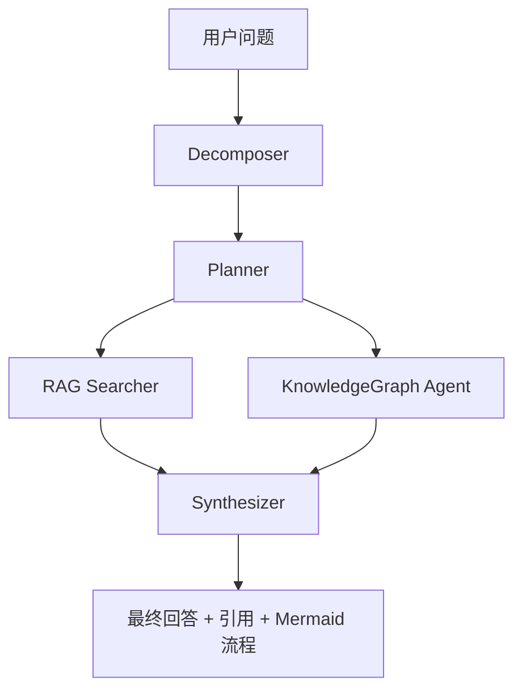

# Agent 架构说明

本文档为中文 Agent 架构说明，内容与 `docs/Agent.md` 保持一致，用于评审快速理解 Agent 的角色分工、工作流与取舍。

## 目标

Agent 工作流用于回答跨章节、跨教材、需要综合检索和图谱关系的问题。它不替代 RAG 或知识图谱，而是把二者编排为可解释的多步骤流程。

## Agent 角色

| Agent | 职责 | 输入 | 输出 |
| --- | --- | --- | --- |
| Decomposer | 将复杂问题拆成 1-5 个子问题 | 用户问题 | 子问题列表 |
| Planner | 为每个子问题安排 RAG 和图谱查询 | 子问题列表 | AgentStep 列表 |
| Searcher | 调用 RAG pipeline | 子问题 | 回答、引用、片段 |
| KnowledgeGraph | 调用图查询引擎 | 子问题 | 节点、边、解释 |
| Synthesizer | 汇总 RAG 与图谱结果 | 执行步骤 | 最终回答和引用 |

## 工作流

## Prompt 与回退

- Decomposer 当前采用规则拆分，避免过早依赖 LLM。
- Graph Query 使用 LLM 解析 `neighbors/path/subgraph/search` 意图；失败时回退到关键词搜索和邻居查询。
- RAG Generator 使用 LLM 生成最终回答；失败时返回基于检索片段的可解释错误。
- Merge Agent 使用 LLM 判断 `merge/keep/remove`；失败时回退规则相似度建议。

## 设计决策与权衡

### 为什么用规则 Decomposer，而不是直接用 LLM

- **速度与成本**：拆分是高频、低复杂度步骤，用规则实现能稳定在毫秒级完成，降低对外部 LLM 的调用次数。
- **可控性**：规则拆分更容易约束子问题数量（1-5 个）与粒度，避免 LLM 把问题拆得过细或出现跑偏子任务。
- **可恢复性**：当 LLM 不可用或超时时，规则拆分仍可工作，保证工作流不中断。

代价：规则对“隐含多意图”的问题识别能力弱于 LLM；为此 Planner/Searcher/Synthesizer 仍可在后续阶段补偿推理。

### 为什么自研 Orchestrator，而不是使用 LangGraph 等框架

- **体积小、依赖少**：本项目希望保持可部署性与可读性，`AgentOrchestrator` 仅依赖现有模块，无需引入大型编排框架。
- **更贴近业务数据流**：步骤结构（RAG/KG 两类）与 SSE 事件（started/step/completed/error）紧密配合，定制实现更直接。
- **可解释与可调试**：每个 step 的 `status/output` 都能被前端完整展示，利于演示与定位问题。

代价：缺少图执行引擎的高级特性（如 checkpoint、并行分支、可视化编排编辑器）；当前通过“步骤可重放 + 错误不致命”来满足演示需求。

## 实时输出

`GET /api/agent/query/stream` 使用 SSE 输出执行过程：

- `started`: 已收到问题并完成拆解
- `step`: 单步执行完成或失败
- `completed`: 返回完整 AgentResult
- `error`: 返回异常详情

前端 Agent Tab 可在 SSE 失败时回退到普通 `POST /api/agent/query`。

## 错误恢复

- 单个步骤失败会被记录为 `failed`，不会中断整个 Orchestrator。
- Synthesizer 会基于可用步骤生成回答；若没有可用证据，返回“当前知识库中未找到足够信息”。
- 前端展示每个步骤的状态和输出，方便定位 RAG、图谱或 LLM 失败点。

## 防幻觉策略

- **JSON 输出强约束**：后端通过 OpenAI-compatible `response_format=json_object` 要求模型输出可解析 JSON，解析失败会抛出错误并进入回退逻辑。
- **低随机性**：LLM 调用固定 `temperature=0.1`，降低发散与编造风险。
- **失败回退**：
	- 节点/关系抽取失败：使用规则抽取兜底，保证图谱可构建。
	- 图查询规划失败：回退到关键词匹配与邻居子图。
	- RAG 生成失败：回退到“检索片段摘要 + 明确来源”。
	- 合并裁决失败：回退到相似度规则建议。
- **引用溯源要求**：RAG 输出要求 `answer` 标注 `[来源序号]`，并返回 `used_sources`，便于前端展示 citations 与评审复现。

## 对标改进吸收

参考 `knowledge-integrator-full` 后，Agent4Study 保留自研 Orchestrator 和 Cytoscape 交互优势，同时吸收以下低风险增强：

- RAG 检索优先使用 Jieba 中文分词，提高中文术语 BM25 命中质量。
- 知识节点增加 `aliases / importance / original_text`，方便跨教材同义合并和报告展示证据。
- 合并裁决增加 `best_node_id`，不仅判断是否合并，也说明哪个版本更适合作为合并后主节点。
- Prompt 中明确 JSON 输出、低温度、失败回退和“证据不足不输出强关系”的防幻觉策略。
