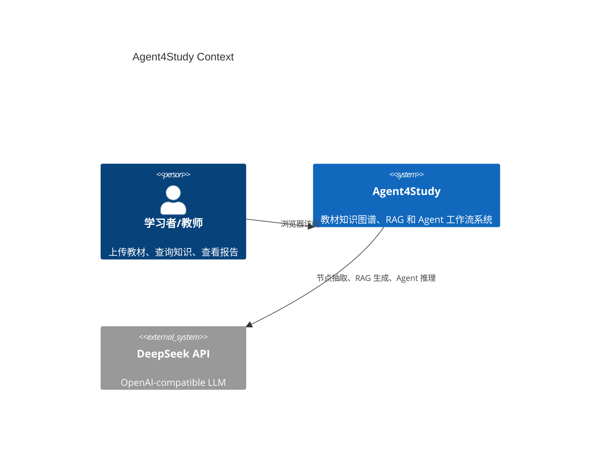
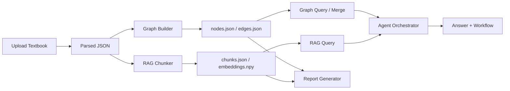

# Agent4Study 系统设计

## 架构概览

## 模块划分

- Frontend：Vue 3 + Vite，包含知识图谱、RAG、知识合并、Agent、报告、设置六个 Tab。
- API：FastAPI 统一暴露 ingestion、graph、rag、agent、settings、report 接口。
- Ingestion：将 PDF、Markdown、TXT、DOCX、Excel 解析为统一教材 JSON。
- Knowledge Graph：抽取知识节点和关系，使用 NetworkX 管理图结构，持久化为 JSON。
- RAG：Recursive chunking、embedding、本地向量存储、BM25 融合检索和引用生成。
- Agent：Decomposer、Planner、Searcher、KnowledgeGraph、Synthesizer 编排。
- Report：读取系统状态和 Benchmark，生成竞赛报告 Markdown。

## 数据流

## 存储约定

- 原始教材：`data/textbooks/`
- 解析产物：`data/parsed/`
- RAG 索引：`data/chunks/`
- 知识图谱：`data/knowledge_graph/`
- Benchmark：`data/rag_benchmark/`
- 报告：`report/`

这些目录下的运行产物默认不提交 Git，避免教材、缓存和评测数据污染仓库。

## 组件交互

- RAG 查询只依赖 `VectorStore`、`HybridRetriever` 和 `RAGGenerator`。
- 图查询只依赖 `GraphStore` 和 `GraphQueryEngine`。
- Agent 不重复实现检索逻辑，而是调用 RAG 和图查询组件。
- UI 通过统一 `frontend/src/api/client.js` 访问接口，错误由全局拦截器转为页面提示。

## 参数选择依据

### RRF 融合权重 0.7 / 0.3

HybridRetriever 使用“向量相似度 + BM25”的 Reciprocal Rank Fusion（RRF）融合排序：

- **0.7 给向量检索**：教材问答更依赖语义相似度，尤其是同义表述、概念解释和跨章节转述。
- **0.3 给 BM25**：BM25 擅长精确词命中（术语、符号、缩写、公式关键字、编号），对 OCR 噪声与中英混排也更鲁棒。

该权重并不假设某一侧绝对更好，而是偏向“语义为主、词法兜底”的工程折中，避免纯向量导致关键词漏召回。

### Chunk: target_size=700, overlap=80

RAG 的 chunking 目标是“足够短以便检索定位 + 足够长以保留定义上下文”。

- **700 字符左右**：通常可覆盖 1-2 个自然段或一个定义块，减少答案生成时缺失前置条件。
- **80 字符 overlap**：跨 chunk 的连续引用（定义后紧跟例子/条件）更容易被检索到，降低“切断导致的断章取义”。

### 为什么用 hybrid，而不是纯向量检索

- **教材场景强术语**：纯向量在遇到非常具体的术语、符号、代码片段时，可能因为语义空间相近而误召回。
- **可解释性**：BM25 的词匹配更易解释；融合结果配合 citations 更利于评审复现。
- **鲁棒性**：两套检索信号互补，能降低单一检索信号失效（如 embedding 质量波动、分词差异）的风险。
