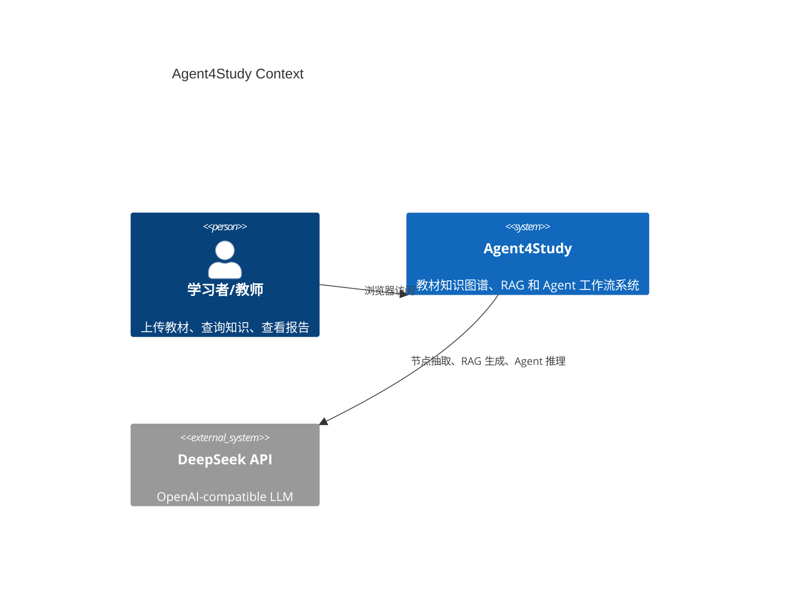
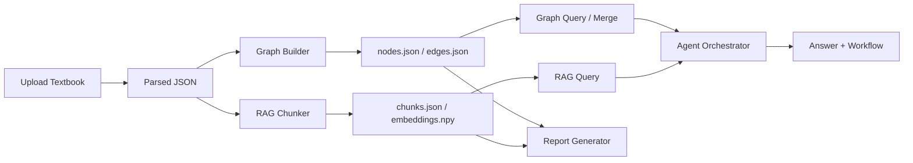

# Agent4Study 系统设计

## 架构概览

## 模块划分

- Frontend：Vue 3 + Vite，包含知识图谱、RAG、知识合并、Agent、报告、设置六个 Tab。
- API：FastAPI 统一暴露 ingestion、graph、rag、agent、settings、report 接口。
- Ingestion：将 PDF、Markdown、TXT、DOCX、Excel 解析为统一教材 JSON。
- Knowledge Graph：抽取知识节点和关系，使用 NetworkX 管理图结构，持久化为 JSON。
- RAG：Recursive chunking、embedding、本地向量存储、BM25 融合检索和引用生成。
- Agent：Decomposer、Planner、Searcher、KnowledgeGraph、Synthesizer 编排。
- Report：读取系统状态和 Benchmark，生成竞赛报告 Markdown。

## 数据流

## 存储约定

- 原始教材：`data/textbooks/`
- 解析产物：`data/parsed/`
- RAG 索引：`data/chunks/`
- 知识图谱：`data/knowledge_graph/`
- Benchmark：`data/rag_benchmark/`
- 报告：`report/`

这些目录下的运行产物默认不提交 Git，避免教材、缓存和评测数据污染仓库。

## 组件交互

- RAG 查询只依赖 `VectorStore`、`HybridRetriever` 和 `RAGGenerator`。
- 图查询只依赖 `GraphStore` 和 `GraphQueryEngine`。
- Agent 不重复实现检索逻辑，而是调用 RAG 和图查询组件。
- UI 通过统一 `frontend/src/api/client.js` 访问接口，错误由全局拦截器转为页面提示。
